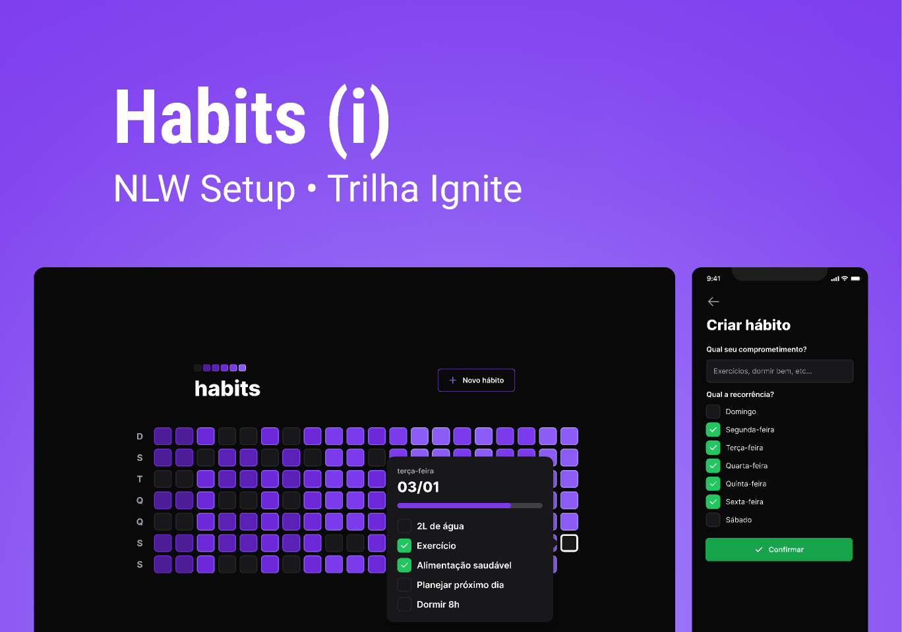

<p align="center">
  
</p>

<br />
<br />

## **💻** Projeto
<br />
Aplicação realizada durante a Imersão “Next Level Week - Setup”, promovido pela Rocketseat, a qual desenvolvemos uma aplicação FullStack (Frontend - Mobile - Backend) para adicionar e controlar seu hábitos diariamente.

<p align="center">
  
</p>

<br />
## Tecnologias utilizadas

- [Typescript](https://www.typescriptlang.org/)
- [clsx](https://www.npmjs.com/package/clsx)
- [ReactJS](https://pt-br.reactjs.org/)
- [React Native](https://reactnative.dev/)
- [Axios](https://axios-http.com/ptbr/docs/intro)
- [TailwindCSS](https://tailwindcss.com/)
- [Radix-UI](https://www.radix-ui.com/docs/primitives/overview/getting-started)
- [phosphor-react](https://phosphoricons.com/)
- [Vite](https://vitejs.dev/)
- [Expo](https://expo.dev/)
- [Dayjs](https://day.js.org/)
- [react-navigation/native](https://reactnavigation.org/)
- [react-native-svg-transformer](https://www.npmjs.com/package/react-native-svg-transformer?activeTab)
- [react-native-reanimated](https://www.npmjs.com/package/react-native-reanimated)
- [react-native-svg](https://www.npmjs.com/package/react-native-svg)
- [react-native-safe-area-context](https://www.npmjs.com/package/react-native-safe-area-context)
- [Fastify](https://www.fastify.io/)
- [zod](https://github.com/colinhacks/zod)
- [Prisma](https://www.prisma.io/)
- [SQlite](https://www.sqlite.org/index.html)

## **🔖** Layout

Você pode visualizar o layout do projeto através do link abaixo:

- [Figma Layout](https://www.notion.so/Habit-Readme-9b4ca5b8d8364254b6f719028b3d328b)

Lembrando que você precisa ter uma conta no [Figma](http://figma.com/)

<br/>

## **🚀** Como Executar

Como o repositório e siga o passo a passo de cada stack.

```bash
## Clone o projeto em sua máquina
git clone [https://github.com/srsouzaj/nlwsetup](https://github.com/srsouzaj/nlwsetup).git

# Acessar o projeto no terminal
$ cd nlwsetup
```

### Backend

```bash
# Acessar a pasta "server"
$ cd server

# Instalar as dependências
$ npm install

# Executar o servidor em modo de desenvolvimento
$ npm run dev

# O servidor será executado na porta 3333 (http://localhost:3333)
```

### Frontend

**Para que esse projeto funcione corretamente, é preciso estar com o servidor rodando.**

```bash
# Acessar a pasta "Web"
$ cd web

# Instalar as dependências
$ npm install

# Executar a aplicação em modo de desenvolvimento
$ npm run dev

# A aplicação será executada na porta indicada pelo Vite em seu terminal
```

### Mobile

**Para que esse projeto funcione corretamente, é preciso estar com o servidor rodando.**

```bash
# Acessar a pasta "Mobile"
$ cd mobiles

# Instalar as dependências
$ npm install

# Executar a aplicação em modo de desenvolvimento
$ npm run dev

# A simulação será feita no emulador indicado no terminal pelo Expo (dispositivo externo ou emulador)
```

<br/>

## 📝 License

Esse projeto está sob a licença MIT. Veja o arquivo [LICENSE](https://github.com/srsouzaj/nlwsetup/blob/main/LICENSE.md) para mais detalhes.

Feito com ❤️ por Jorge de Souza
